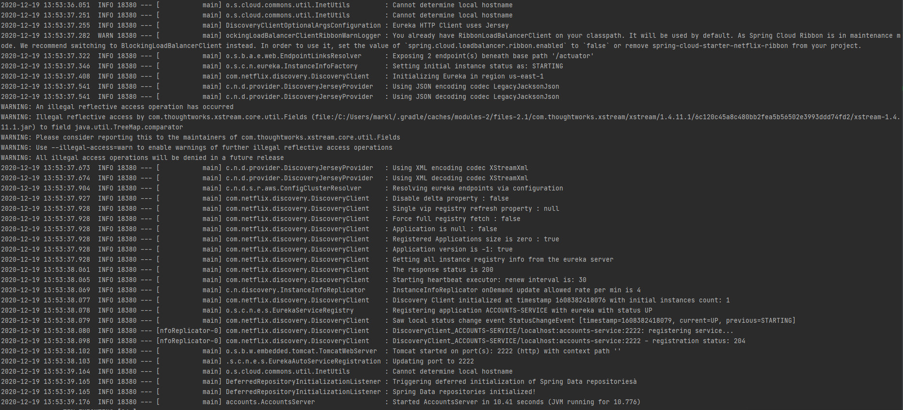
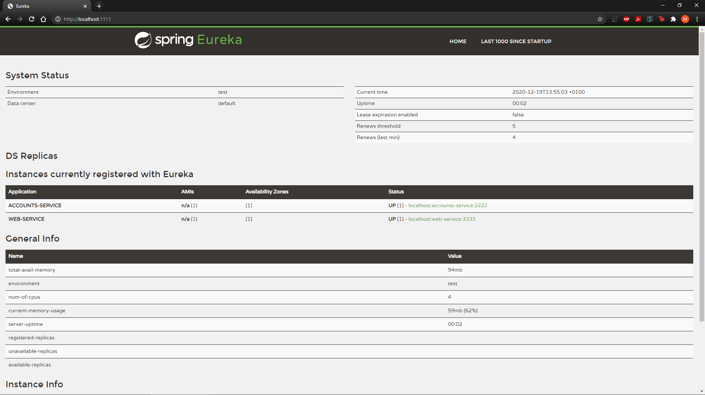
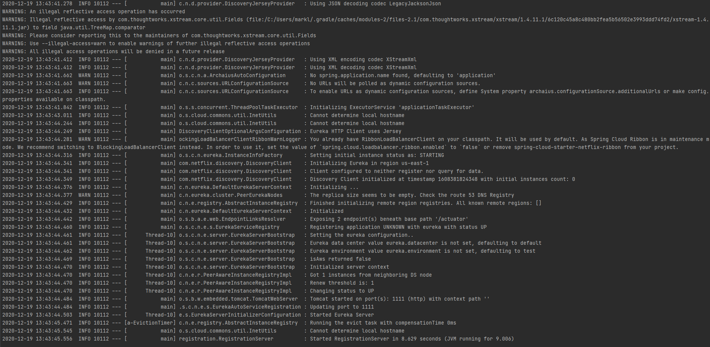
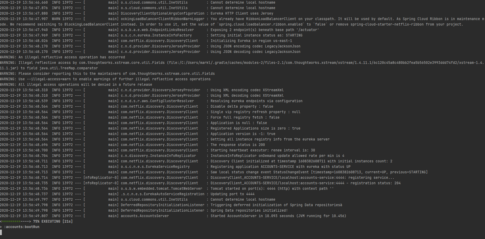
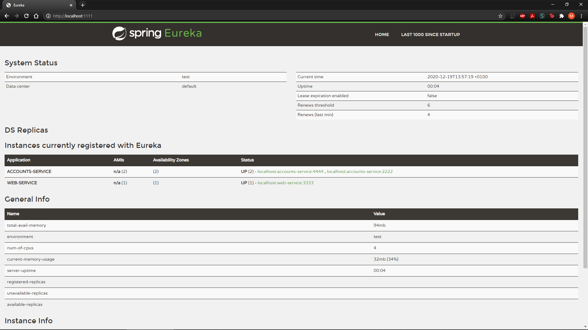

**The two microservices are running and registered (two terminals, logs screenshots).**
        - Accounts 2222 log: 
        - Web: 

**The service registration service has the two microservices registered (a third terminal, dashboard screenshots)**
        - Dashboard: 
        - Registration: 

**A second account microservice is running in the port 4444 and it is registered (a fourth terminal, log screenshots).**
        - Accounts 4444 log: 
        - Dashboard: 

**What happens when you kill the microservice accounts (2222) and do requests to web?
  Can the web service provide information about the accounts again? Why?**
        - When you end the process set on port 2222 that makes the registration notice that the account set on port 2222
          is down, so if we check the dashboard on the browser we will see that there is only one proccess running which
          is the account set on port 4444.