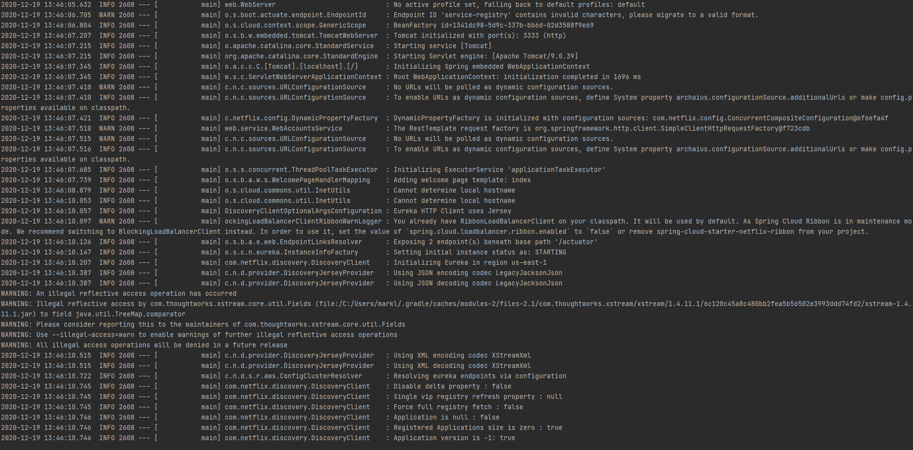

**The two microservices are running and registered (two terminals, logs screenshots).**
        - Accounts 2222 log: 
        - Web: 

**The service registration service has the two microservices registered (a third terminal, dashboard screenshots)**
        - Dashboard: 
        - Registration: 

**A second account microservice is running in the port 4444 and it is registered (a fourth terminal, log screenshots).**
        - Accounts 4444 log: 
        - Dashboard: 

**What happens when you kill the microservice accounts (2222) and do requests to web?
  Can the web service provide information about the accounts again? Why?**